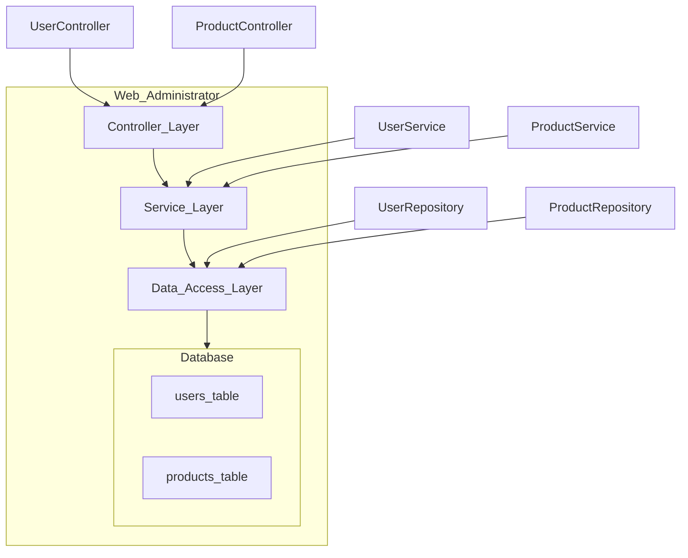
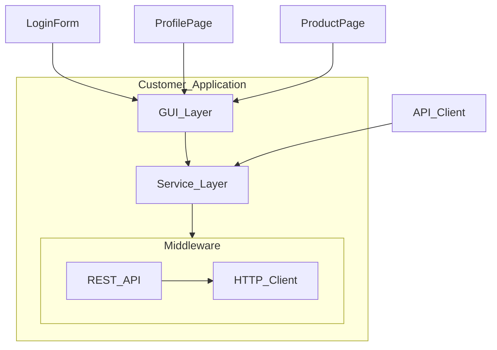
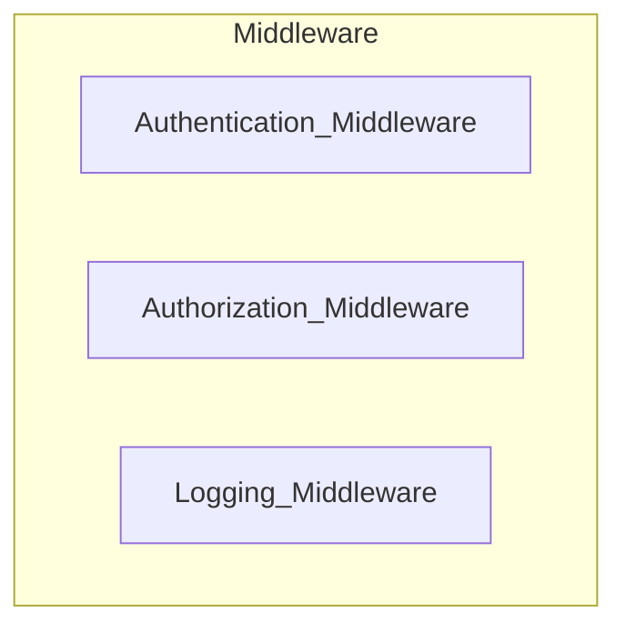

# Custom PC Shop Project

This project involves multiple applications to manage a custom PC shop, including user authentication, product management, and purchasing functionalities.

## Applications Involved

### 1. Web Administrator (Laravel)
- **Description**: This web application is used by administrators to manage products. It is built using the Laravel framework.


### 2. Customer Application (Java Swing)
- **Description**: This desktop application allows customers to log in and purchase products. It is built using Java Swing.


## Architecture/Layer Diagram


### Web Administrator (Laravel)



## Explanation

**Web Administrator**: This part of the application is responsible for managing users and products. It follows a layered architecture to separate concerns and improve maintainability.

### Controller Layer

Handles HTTP requests and responses. Controllers process incoming requests, call the appropriate service methods, and return responses.

- **UserController** and **ProductController** are part of this layer. They handle user and product-related requests, respectively.

### Service Layer

Contains business logic. Services perform operations by using repositories to interact with the database.

- **UserService** and **ProductService** are part of this layer. They contain business logic for user and product management.

### Data Access Layer

Manages database interactions. Repositories are used to abstract the data access operations.

- **UserRepository** and **ProductRepository** are part of this layer. They interact with the `users_table` and `products_table`, respectively.

### Database

Stores the application's data. It includes the `users_table` and `products_table`.


### Customer Application (Java Swing)



## Explanation

**Customer Application**: This is a desktop application that allows customers to log in and purchase products. It is built using Java Swing and follows a layered architecture.

### GUI Layer

Contains the user interface components.

- **LoginForm**, **ProfilePage**, and **ProductPage** are part of this layer. They provide the UI for logging in, viewing profiles, and browsing products.

### Service Layer

Contains logic for communicating with the backend. It uses an API client to make HTTP requests.

- **API_Client** is part of this layer. It handles the communication with the REST API.

### Middleware

Facilitates communication between the GUI layer and the backend. It includes an HTTP client to send requests to the REST API.

- **HTTP_Client** is part of this layer. It sends requests to the backend.
- **REST_API** is the backend API that the client communicates with.


### Middleware



## Explanation:

**Middleware**: Handles common tasks for incoming requests such as authentication, authorization, and logging.

### Authentication Middleware

Verifies user credentials during login.

### Authorization Middleware

Ensures the user has the necessary permissions for certain actions.

### Logging Middleware

Logs incoming requests and outgoing responses for monitoring and debugging purposes.


# List of URL Endpoints (Middleware RESTful)

### User Authentication Endpoints
- `POST /login`: Login an existing user.

### Product Management Endpoints
- `GET /products`: Retrieve a list of all products.
- `PUT /products/{id}`: Update the details of a specific product by ID.

## Functions/Features in the Middleware

- **Authentication Middleware**: Verifies the user's credentials during login.
- **Authorization Middleware**: Ensures the user has the necessary permissions to perform certain actions.
- **Logging Middleware**: Logs all the incoming requests and outgoing responses for monitoring and debugging purposes.

## Database and Tables Involved

### User Authentication and Product Management (Laravel Database)

### `users` Table
| Column             | Type            | Description                      |
|--------------------|-----------------|----------------------------------|
| id                 | bigint unsigned | Primary Key                      |
| name               | varchar(255)    | User's name                      |
| email              | varchar(255)    | User's email address             |
| email_verified_at  | timestamp       | Email verification timestamp     |
| password           | varchar(255)    | User's hashed password           |
| level              | varchar(255)    | User's level/role                |
| created_at         | timestamp       | Record creation timestamp        |
| updated_at         | timestamp       | Record update timestamp          |

### `products` Table
| Column        | Type            | Description                    |
|---------------|-----------------|--------------------------------|
| id            | bigint unsigned | Primary Key                    |
| title         | varchar(255)    | Product title                  |
| price         | varchar(255)    | Product price                  |
| product_code  | varchar(255)    | Unique code for the product    |
| description   | varchar(255)    | Product description            |
| quantity      | varchar(255)    | Available quantity             |
| status        | varchar(255)    | Product status (e.g., active)  |
| created_at    | timestamp       | Record creation timestamp      |
| updated_at    | timestamp       | Record update timestamp        |

## How to Run the Project


1. **Set up the databases**:
    - Create `laravel_db` database.
    - Run the provided SQL scripts to create the tables.

2. **Run the Laravel Web Administrator**:
    Replace the given folder in the `LaravelCode` folder after installing the Laravel package.

    ```sh
    cd web-administrator
    php artisan serve --host 192.168.1.116
    ```

3. **Run the Customer Application (Java Swing) in Eclipse**:
    - Open Eclipse IDE.
    - Import the Java project:
      - Go to `File > Import`.
      - Select `Existing Projects into Workspace` under the `General` category.
      - Click `Next`.
      - Browse to the directory where your Java project is located.
      - Select the project and click `Finish`.
    - Run the `LoginForm` class:
      - In the `Package Explorer`, navigate to the `LoginForm` class.
      - Right-click on `LoginForm` and select `Run As > Java Application`.

4. **Access the application**:
    - Web Administrator: Open your web browser and go to `http://192.168.1.116:8000`.
    - Customer Application: Run the Java Swing application from Eclipse as described above.


